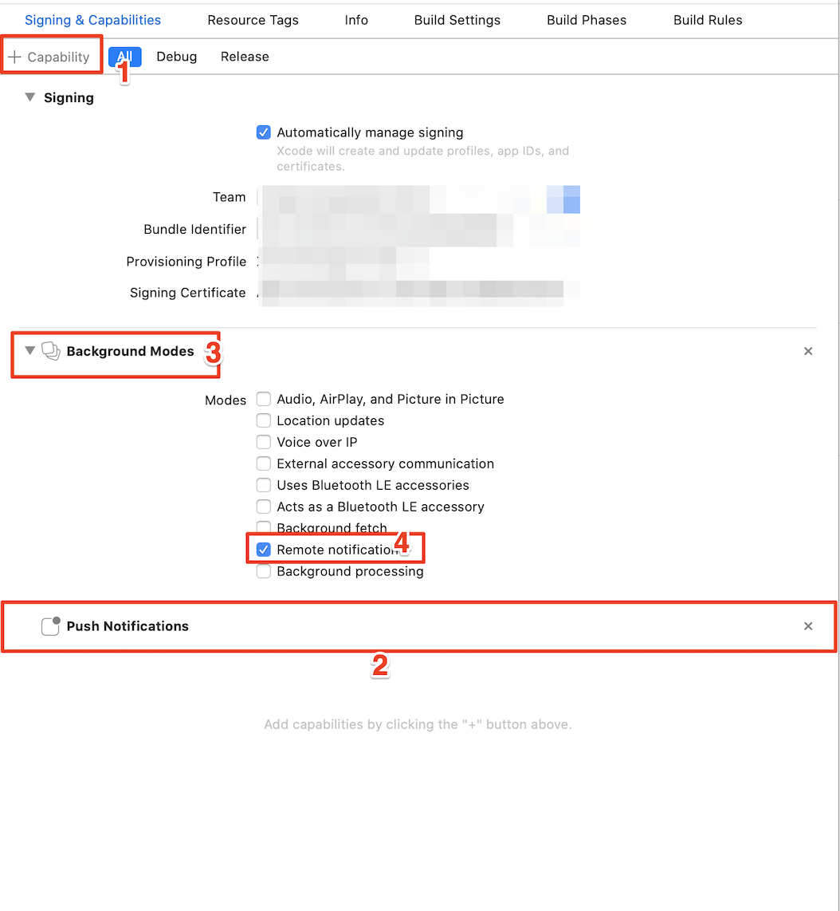

# Flutter Plugin for Responsys Mobile SDK

This plugin makes it easy to integrate the Responsys Mobile SDK with your Flutter app. 

## Table of Contents
- [Requirements](#requirements)	
  * [For Android](#for-android)
  * [For iOS](#for-ios)
- [Setup](#setup)
  * [For Android](#for-android-1)
  * [For iOS](#for-ios-1)
- [Installation](#installation)
- [Integration](#integration)
  * [For Android](#for-android-2)
  * [For iOS](#for-ios-2)
- [Usage](#usage)
  * [Configure And Register](#configure-and-register)
  * [User Identification](#user-identification)
  * [Engagements And Conversion](#engagements-and-conversion)
  * [In-App Messages](#in-app-messages)
  * [Message Center](#message-center)
  * [Geofences And Beacons](#geofences-and-beacons)
  * [Notification Preferences](#notification-preferences)
- [Support](#support)
- [License](#license)


## Requirements

- Flutter >= 2.0.3

### For Android
- Android SDK Tools >= 28.0.3

### For iOS
- iOS 12 or later

## Setup

Before installing the plugin, you must setup your app to receive push notifications.

### For Android
- [Get FCM Credentials](https://docs.oracle.com/en/cloud/saas/marketing/responsys-develop-mobile/android/gcm-credentials) 
- Log in to the [Responsys Mobile App Developer Console](https://docs.oracle.com/en/cloud/saas/marketing/responsys-develop-mobile/dev-console/login/) and enter your FCM credentials (Project ID and Server API Key) for your Android app.
- Get the `pushio_config.json` file generated from your credentials and place it in your project's `android/app/src/main/assets` folder. You might have to create the directory if it is not already present.
- Download the SDK from [here](https://www.oracle.com/downloads/applications/cx/responsys-mobile-sdk.html) and place it in the project's `android/app/libs` folder. 


### For iOS
- [Generate Auth Key](https://docs.oracle.com/en/cloud/saas/marketing/responsys-develop-mobile/ios/auth-key/) 
- Log in to the [Responsys Mobile App Developer Console](https://docs.oracle.com/en/cloud/saas/marketing/responsys-develop-mobile/dev-console/login/) and enter your Auth Key and other details for your iOS app.
- Download the `pushio_config.json` file generated from your credentials.
- After adding the plugin in your app, copy `PushIOManager.xcframework` and place it in the plugin ios directory - `pushiomanager-flutter/ios/`. 
- Run `pod install` in the `your_app_directory/ios/` directory, after adding the plugin in to your app and copying `PushIOManager.xcframework` in  `pushiomanager-flutter/ios/` directory. 

## Installation

Add the following dependency to your `pubspec.yaml`,

```yaml
dependencies:
pushiomanager_flutter:
  	git:
  		url: https://github.com/oracle-samples/pushiomanager_flutter.git
```

and run `flutter pub get` from command-line.


## Integration

### For Android

- Open the `build.gradle` file located in `android/app/` and add the following dependency,
	
	```gradle
	implementation 'com.google.firebase:firebase-messaging:18.0.0' 
	```
	
	**NOTE**: If your app uses `firebase-messaging` library version 21.0.0 or later, it is required to add the following dependency as well,
	
	```gradle
	implementation 'com.google.android.gms:play-services-base:16.1.0' 
	```

- Open the `AndroidManifest.xml` file located in `android/app/src/main` and add the following,
	* Permissions above the `<application>` tag,

		```xml
		<!-- If your app requires user location -->
		<uses-permission android:name="android.permission.ACCESS_FINE_LOCATION" />
		
		<uses-permission android:name="${applicationId}.permission.PUSHIO_MESSAGE" />
		<uses-permission android:name="${applicationId}.permission.RSYS_SHOW_IAM" />
		<permission android:name=".permission.PUSHIO_MESSAGE" android:protectionLevel="signature" />
		<permission android:name="${applicationId}.permission.RSYS_SHOW_IAM" android:protectionLevel="signature" />
		```
	
	* Intent-filter for launching app when the user taps on a push notification. Add it inside the `<activity>` tag of `MainActivity`,

		```xml
		<intent-filter>
			<action android:name="${applicationId}.NOTIFICATIONPRESSED" />
	   		<category android:name="android.intent.category.DEFAULT" />
		</intent-filter>
		```
		
	* Add the following code inside `<application>` tag,

		```xml
		 <receiver android:enabled="true" android:exported="false" android:name="com.pushio.manager.PushIOUriReceiver">
            <intent-filter>
                <action android:name="android.intent.action.VIEW" />
                <category android:name="android.intent.category.DEFAULT" />
                <data android:scheme="@string/uri_identifier" />
            </intent-filter>
        </receiver>
        <activity android:name="com.pushio.manager.iam.ui.PushIOMessageViewActivity" android:permission="${applicationId}.permission.SHOW_IAM" android:theme="@android:style/Theme.Translucent.NoTitleBar">
            <intent-filter>
                <action android:name="android.intent.action.VIEW" />
                <category android:name="android.intent.category.BROWSABLE" />
                <category android:name="android.intent.category.DEFAULT" />
                <data android:scheme="@string/uri_identifier" />
            </intent-filter>
        </activity>
		```
	* (Optional) Intent-filter for [Android App Links](https://developer.android.com/training/app-links) setup. Add it inside the `<activity>` tag of `MainActivity`,

		```xml
		<intent-filter android:autoVerify="true">
			<action android:name="android.intent.action.VIEW" />
			<category android:name="android.intent.category.DEFAULT" />
			<category android:name="android.intent.category.BROWSABLE" />
			<data android:host="@string/app_links_url_host" android:pathPrefix="/pub/acc" android:scheme="https" />
       </intent-filter>
		```
		

- Open the `strings.xml` file located at `android/app/src/main/res/values` and add the following properties,

	* Custom URI scheme for displaying In-App Messages and Rich Push content,

		```xml
		<string name="uri_identifier">pio-YOUR_API_KEY</string>
		```
	You can find the API key in the `pushio_config.json` that was placed in `android/app/src/main/assets` earlier during setup.
		
	* (Optional) If you added the `<intent-filter>` for Android App Links in the steps above, then you will need to declare the domain name,
	
		```xml
		<string name="app_links_url_host">YOUR_ANDROID_APP_LINKS_DOMAIN</string>
		```


### For iOS
- Open the **Xcode project workspace** in your `ios` directory of flutter app. 
- Drag and Drop your `pushio_config.json` in Xcode project.
- Go to build settings of your app project (not target) and search for other linker flags.
- Enter `-ObjC -all_load`. Please check below image.

- Select the root project and Under Capabilites add the "Push Notifications" and "Background Modes". 

- For In-App Messages and Rich Push Content follow the below steps :
  * To Enable Custom URI scheme for displaying In-App Messages and Rich Push content follow the [Step 1](https://docs.oracle.com/en/cloud/saas/marketing/responsys-develop-mobile/ios/in-app-msg/). You don't need to add the code.
  You can find the API key in the `pushio_config.json` that was placed in your Xcode project earlier during setup.
  
  * Follow  [Step 2](https://docs.oracle.com/en/cloud/saas/marketing/responsys-develop-mobile/ios/in-app-msg/) to  add the required capabilites in your Xcode project for In-App messages. You don't need to add the code.

- For Media Attachments you can follow the following [guide](https://docs.oracle.com/en/cloud/saas/marketing/responsys-develop-mobile/ios/media-attachments/). Copy and paste the code provided in guide in respective files.	

- For Carousel Push you can follow the following [guide](https://docs.oracle.com/en/cloud/saas/marketing/responsys-develop-mobile/ios/carousel-push/). Copy and paste the code provided in guide in respective files.    

### Usage

The plugin can be accessed in your app as follows,

```dart
import 'package:pushiomanager_flutter/pushiomanager_flutter.dart';
```


### Configure And Register

- Configure the SDK,

	```dart
	PushIOManager.configure("pushio_config.json")
        .then((_) => print("SDK configured successfully"))
        .catchError((error) => print("SDK configure error: $error"));
	```
	
- Once the SDK is configured, register the app with Responsys,
	- Use `Platform` from `dart:io` package to detect the platform.        

   ```dart
   if (Platform.isAndroid) {
   		PushIOManager.registerApp(useLocation: true)
   			.then((_) => print("Registration Successful"))
   			.catchError((error) => print("Registration error: $error"));
  	} else if (Platform.isIOS) {
      PushIOManager.registerForAllRemoteNotificationTypes().then((_) => { 
        PushIOManager.registerApp() 
      }).then((_) => print("Registration Successful"))
          .catchError((error) => print("Registration error: $error"));
    }  	
   ```


### User Identification

- Associate an app installation with a user (usually after login),

	```dart
	PushIOManager.registerUserId("userID");
	```
	
- When the user logs out,

	```dart
	PushIOManager.unregisterUserId();
	```
	

### Engagements And Conversion

User actions can be attributed to a push notification using,

```dart
PushIOManager.trackEngagement(EngagementType.PURCHASE)
	.then((_) => print("Engagement Reported Successfully"))
	.catchError((error) => print("Engagement not reported: $error"));
```

### In-App Messages

In-App Message (IAM) are displayed in a popup window via system-defined triggers like `$ExplicitAppOpen` or custom triggers. IAM that use system-defined triggers are displayed automatically.

IAM can also be displayed on-demand using custom triggers.

- Your marketing team defines a custom trigger in Responsys system and shares the trigger-event name with you.
- Marketer launches the campaign and the IAM is delivered to the device via push or pull mechanism (depending on your Responsys Account settings)
- When you wish to display the IAM popup, use,

	```dart
	PushIOManager.trackEvent("custom_event_name");
	```


### Message Center

- Get the Message Center messages list using,
```
Each Message Center message now supports an additional property called custom key-value pairs, it is a variable sized object with key value pairs and can be accessed like any other property of that message.

```

	```dart
	PushIOManager.fetchMessagesForMessageCenter("Primary")
		.then((messages) => { 
			// messages is a list of MessageCenterMessage
            for (var message in messages) {
                print(message.messageID);
                print(message.message);
                print(message.customKeyValuePairs);
            }
		}
	);
	```
	
- To get the message content call,

	```dart
	PushIOManager.fetchRichContentForMessage(message.messageID)
        .then((response) => { 
        		// response['richContent'] has the content 
        })
        .catchError((error) => print("Error fetching rich content: $error"));
	```
	
	Remember to store these messages, since the SDK cache is purgeable.
	

### Geofences And Beacons

If your app is setup to monitor geofence and beacons, you can record in Responsys when a user enters/exits a geofence/beacon zone.

Following is a sample code for recording a geofency-entry event.

```dart
PushIOManager.onGeoRegionEntered(region)
	.then((response) => print(
            "$response['regionType'] with ID - $response['regionID'] successfully reported"))
    .catchError((error) =>
    	print("Unable to report \$GEOFENCE_ENTRY event: $error"));
```


### Notification Preferences

Preferences are used to record user-choices for push notifications. The preferences should be [pre-defined in Responsys](https://docs.oracle.com/en/cloud/saas/marketing/responsys-develop-mobile/dev-console/app-design/#notification-preferences) before being used in your app.

- Declare the preference beforehand in the app,

	```dart
	PushIOManager.declarePreference(key, "Label to show in UI", PreferenceType.STRING)
		.then((_) => print("Preference declared successfully"))
		.catchError((error) => { print("Preference could not be declared: $error") });
	```

- Once a preference is declared successfully, you may save the preference using,

	```dart
	PushIOManager.setPreference(key, "Test Value")
		.then((_) => print("Preference set successfully"))
		.catchError((error) => print("Preference not set: $error"));
	```
	
Do not use this as a persistent (key/value) store since this data is purgeable.


## Support

If you have access to My Oracle Support, please raise a request [here](http://support.oracle.com/), otherwise open an issue in this repository. 

Please consult the [security guide](./SECURITY.md) for our responsible security vulnerability disclosure process

## License

Copyright (c) 2023 Oracle and/or its affiliates.
Released under the Universal Permissive License v1.0 as shown at
<https://oss.oracle.com/licenses/upl/>.
