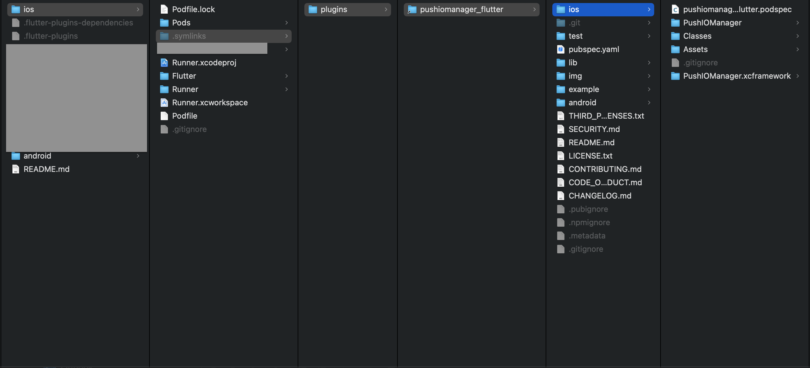
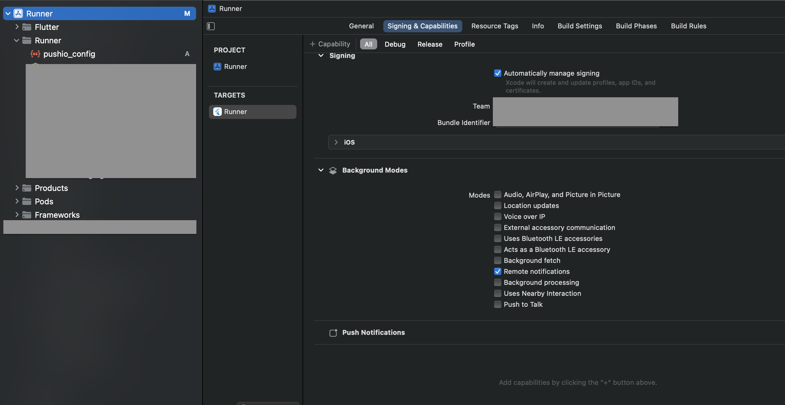

# Flutter Plugin for Responsys Mobile SDK

This plugin makes it easy to integrate the Responsys Mobile SDK with your Flutter app. 

## Table of Contents
- [Requirements](#requirements)	
  * [For Android](#for-android)
  * [For iOS](#for-ios)
- [Setup](#setup)
  * [For Android](#for-android-1)
  * [For iOS](#for-ios-1)
  		* [Location SDK](#location-sdk)
- [Installation](#installation)
- [Integration](#integration)
  * [For Android](#for-android-2)
  * [For iOS](#for-ios-2)
- [Usage](#usage)
  * [Configure And Register](#configure-and-register)
  * [User Identification](#user-identification)
  * [Engagements And Conversion](#engagements-and-conversion)
  * [In-App Messages](#in-app-messages)
  * [Message Center](#message-center)
  * [Geofences And Beacons](#geofences-and-beacons)
  * [Notification Preferences](#notification-preferences)
  * [Handling Deeplink](#handling-deeplink)
- [Support](#support)
- [License](#license)

<br/>

## Requirements

- Flutter >= 2.0.3

### For Android
- Android SDK Tools >= 28.0.3

### For iOS
- iOS 12 or later

<br/>

## Setup

Before installing the plugin, you must setup your app to receive push notifications.

<br/>

### For Android
- [Get FCM Credentials](https://docs.oracle.com/en/cloud/saas/marketing/responsys-develop-mobile/android/fcm-credentials.htm) 
- Log in to the [Responsys Mobile App Developer Console](https://docs.oracle.com/en/cloud/saas/marketing/responsys-develop-mobile/dev-console/login/) and enter your FCM credentials (Project ID and Server API Key) for your Android app.
- Get the `pushio_config.json` file generated from your credentials and place it in your project's `android/app/src/main/assets` folder. You might have to create the directory if it is not already present.
- Download the latest SDK binary from [here](https://www.oracle.com/downloads/applications/cx/responsys-mobile-sdk.html). 
- Create a new directory  - `PushIOManager` inside your app's `android` directory.
- Inside the `android/PushIOManager` directory, create a file `build.gradle` with the following code:

	```gradle
	configurations.maybeCreate("default")
	artifacts.add("default", file('oracle-cx-mobile-base-7.0.1.aar'))

	//Optional
	//artifacts.add("default", file('oracle-cx-mobile-location-7.0.0.aar'))
	```		

- Add the following to your project-wide `settings.gradle` file:

	```gradle
	include ':PushIOManager'
	project(':PushIOManager').projectDir = new File(rootProject.projectDir, './PushIOManager')
	```
<br/>

### For iOS
- [Generate Auth Key](https://docs.oracle.com/en/cloud/saas/marketing/responsys-develop-mobile/ios/auth-key/) 
- Log in to the [Responsys Mobile App Developer Console](https://docs.oracle.com/en/cloud/saas/marketing/responsys-develop-mobile/dev-console/login/) and enter your Auth Key and other details for your iOS app.
- Download the `pushio_config.json` file generated from your credentials.
- Download the SDK binary from [here](https://www.oracle.com/downloads/applications/cx/responsys-mobile-sdk.html).
- After adding the plugin in your app, copy `CX_Mobile_SDK.xcframework` and place it in the plugin ios directory - `pushiomanager-flutter/ios/`. Make sure to remove the `PushIOManager.xcframework` if previously copied to this path



- Run `pod install` in the `your_app_directory/ios/` directory.


#### Location SDK

Now the Location APIs are part of `OracleCXLocationSDK.xcframework`.  If app developer need to track the location info only then app need to include the location API in the app and then follow the App Store guideline.

##### Setup
  - After adding the plugin in your app, copy `OracleCXLocationSDK.xcframework` and place it in the plugin ios directory - `pushiomanager-flutter/ios/`. 
  - App Developers need to update authorization level of access for Location authorization request. add related Privacy Location descriptiions in Info.plist of xcode project, refer this for more info [Location Descriptions](https://developer.apple.com/documentation/corelocation/requesting-authorization-to-use-location-services#Provide-descriptions-of-how-you-use-location-services)


 ```xml
	<key>NSLocationAlwaysUsageDescription</key>
	<string>Add description for background location usage</string>
	<key>NSLocationWhenInUseUsageDescription</key>
	<string>Add description for foreground only location usage.</string>
```

- The flutter `permission_handler` plugin use macros to control whether a permission is enabled. App Developers must list the permission want to use in  application. refer this for more information [permission_handler](https://pub.dev/packages/permission_handler)
       * Add the following to your Podfile file:

	
	  ```text
	   post_install do |installer|
  	   	installer.pods_project.targets.each do |target|
       		flutter_additional_ios_build_settings(target)
    			target.build_configurations.each do |config|
						## You can remove unused permissions here
      					## for more information: https://github.com/BaseflowIT/flutter-permission-handler/blob/master/permission_handler/ios/Classes/PermissionHandlerEnums.h

      					config.build_settings['GCC_PREPROCESSOR_DEFINITIONS'] ||= [
        				'$(inherited)',

        				## The 'PERMISSION_LOCATION' macro enables the `locationWhenInUse` and `locationAlways` permission. If
        				## the application only requires `locationWhenInUse`, only specify the `PERMISSION_LOCATION_WHENINUSE`
       				    ## macro.
        				##
       					## dart: [PermissionGroup.location, PermissionGroup.locationAlways, PermissionGroup.locationWhenInUse]
        				'PERMISSION_LOCATION=1',
        				'PERMISSION_LOCATION_WHENINUSE=0'
      					] 
	  			end
  	  	end	
	  end
		```


- In iOS, the registration API accept boolean input for Location. refer   [Configure And Register](#configure-and-register) for Register API implementation.
		* true - `OracleCXLocationSDK.xcframework` request for Location authorization and  Location permission popup will be displayed to user.
		* false -  SDK will not use Location and Location pop will not be displayed to user.

<br/>

## Installation

Add the following dependency to your `pubspec.yaml`,

```yaml
dependencies:
pushiomanager_flutter:
  	git:
  		url: https://github.com/oracle-samples/pushiomanager-flutter.git
```

and run `flutter pub get` from command-line.


## Integration

### For Android

- Open the `build.gradle` file located in `android/app/` and add the following dependency,
	
	```gradle
	implementation 'com.google.firebase:firebase-messaging:18.0.0' 
	```
	
	**NOTE**: If your app uses the native `firebase-messaging` library version 21.0.0 or later, it is required to add the following dependency as well,
	
	```gradle
	implementation 'com.google.android.gms:play-services-base:16.1.0' 
	```

- Open the `AndroidManifest.xml` file located in `android/app/src/main` and add the following,
	* Permissions above the `<application>` tag,

		```xml
		<!-- If your app requires user location -->
		<uses-permission android:name="android.permission.ACCESS_FINE_LOCATION" />
		
		<uses-permission android:name="${applicationId}.permission.PUSHIO_MESSAGE" />
		<uses-permission android:name="${applicationId}.permission.RSYS_SHOW_IAM" />
		<permission android:name=".permission.PUSHIO_MESSAGE" android:protectionLevel="signature" />
		<permission android:name="${applicationId}.permission.RSYS_SHOW_IAM" android:protectionLevel="signature" />
		```
	
	* Intent-filter for launching app when the user taps on a push notification. Add it inside the `<activity>` tag of `MainActivity`,

		```xml
		<intent-filter>
			<action android:name="${applicationId}.NOTIFICATIONPRESSED" />
	   		<category android:name="android.intent.category.DEFAULT" />
		</intent-filter>
		```
		
	* Add the following code inside `<application>` tag,

		```xml
		 <receiver android:enabled="true" android:exported="false" android:name="com.pushio.manager.PushIOUriReceiver">
            <intent-filter>
                <action android:name="android.intent.action.VIEW" />
                <category android:name="android.intent.category.DEFAULT" />
                <data android:scheme="@string/uri_identifier" />
            </intent-filter>
        </receiver>
        <activity android:name="com.pushio.manager.iam.ui.PushIOMessageViewActivity" android:permission="${applicationId}.permission.SHOW_IAM" android:theme="@android:style/Theme.Translucent.NoTitleBar">
            <intent-filter>
                <action android:name="android.intent.action.VIEW" />
                <category android:name="android.intent.category.BROWSABLE" />
                <category android:name="android.intent.category.DEFAULT" />
                <data android:scheme="@string/uri_identifier" />
            </intent-filter>
        </activity>
		```
	* (Optional) Intent-filter for [Android App Links](https://developer.android.com/training/app-links) setup. Add it inside the `<activity>` tag of `MainActivity`,

		```xml
		<intent-filter android:autoVerify="true">
			<action android:name="android.intent.action.VIEW" />
			<category android:name="android.intent.category.DEFAULT" />
			<category android:name="android.intent.category.BROWSABLE" />
			<data android:host="@string/app_links_url_host" android:pathPrefix="/pub/acc" android:scheme="https" />
       </intent-filter>
		```
		

- Open the `strings.xml` file located at `android/app/src/main/res/values` and add the following properties,

	* Custom URI scheme for displaying In-App Messages and Rich Push content,

		```xml
		<string name="uri_identifier">pio-YOUR_API_KEY</string>
		```
	You can find the API key in the `pushio_config.json` that was placed in `android/app/src/main/assets` earlier during setup.
		
	* (Optional) If you added the `<intent-filter>` for Android App Links in the steps above, then you will need to declare the domain name,
	
		```xml
		<string name="app_links_url_host">YOUR_ANDROID_APP_LINKS_DOMAIN</string>
		```


### For iOS
- Open the **Xcode project workspace** in your `ios` directory of flutter app. 
- Drag and Drop your `pushio_config.json` in Xcode project.
- Select the root project and Under Capabilites add the "Push Notifications" and "Background Modes". 

- For In-App Messages and Rich Push Content follow the below steps :
  * To Enable Custom URI scheme for displaying In-App Messages and Rich Push content follow the [Step 1](https://docs.oracle.com/en/cloud/saas/marketing/responsys-develop-mobile/ios/in-app-msg/). You don't need to add the code.
  You can find the API key in the `pushio_config.json` that was placed in your Xcode project earlier during setup.
  
  * Follow  [Step 2](https://docs.oracle.com/en/cloud/saas/marketing/responsys-develop-mobile/ios/in-app-msg/) to  add the required capabilites in your Xcode project for In-App messages. You don't need to add the code.

- For Media Attachments you can follow the following [guide](https://docs.oracle.com/en/cloud/saas/marketing/responsys-develop-mobile/ios/media-attachments/). Copy and paste the code provided in guide in respective files.	

- For Carousel Push you can follow the following [guide](https://docs.oracle.com/en/cloud/saas/marketing/responsys-develop-mobile/ios/carousel-push/). Copy and paste the code provided in guide in respective files.    

### Usage

The plugin can be accessed in your app as follows,

```dart
import 'package:pushiomanager_flutter/pushiomanager_flutter.dart';
```


### Configure And Register

- Configure the SDK,

	```dart
	PushIOManager.configure("pushio_config.json")
        .then((_) => print("SDK configured successfully"))
        .catchError((error) => print("SDK configure error: $error"));
	```
	
- Once the SDK is configured, register the app with Responsys,
	- Use `Platform` from `dart:io` package to detect the platform.        

   ```dart
   if (Platform.isAndroid) {
   		PushIOManager.registerAppForPush(true, false)
   			.then((_) => print("Registration Successful"))
   			.catchError((error) => print("Registration error: $error"));
  	} else if (Platform.isIOS) {
      PushIOManager.registerForAllRemoteNotificationTypes().then((_) => { 
        PushIOManager.registerApp(useLocation: true) 
      }).then((_) => print("Registration Successful"))
          .catchError((error) => print("Registration error: $error"));
    }  	
   ```
   - For iOS Register API, registerApp will have boolean input which will used to pass Location Attributes in Registration Payload,
      * true - SDK will use Core Location and Location permission popup will be displayed to user only if `OracleCXLocationSDK.xcframework` copied to ios folder.
	  * false -  SDK will not use Location and Location pop will not be displayed to user.


### User Identification

- Associate an app installation with a user (usually after login),

	```dart
	PushIOManager.registerUserId("userID");
	```
	
- When the user logs out,

	```dart
	PushIOManager.unregisterUserId();
	```
	

### Engagements And Conversion

User actions can be attributed to a push notification using,

```dart
PushIOManager.trackEngagement(EngagementType.PURCHASE)
	.then((_) => print("Engagement Reported Successfully"))
	.catchError((error) => print("Engagement not reported: $error"));
```

### In-App Messages

In-App Message (IAM) are displayed in a popup window via system-defined triggers like `$ExplicitAppOpen` or custom triggers. IAM that use system-defined triggers are displayed automatically.

IAM can also be displayed on-demand using custom triggers.

- Your marketing team defines a custom trigger in Responsys system and shares the trigger-event name with you.
- Marketer launches the campaign and the IAM is delivered to the device via push or pull mechanism (depending on your Responsys Account settings)
- When you wish to display the IAM popup, use,

	```dart
	PushIOManager.trackEvent("custom_event_name");
	```

#### For iOS

These below steps are required for iOS In-App Messages.

  * To Enable Custom URI scheme for displaying In-App Messages and Rich Push content follow the [Step 1](https://docs.oracle.com/en/cloud/saas/marketing/responsys-develop-mobile/ios/in-app-msg.htm).
  You can find the API key in the `pushio_config.json` that was placed in your Xcode project earlier during setup.
  
  * Follow  [Step 2](https://docs.oracle.com/en/cloud/saas/marketing/responsys-develop-mobile/ios/in-app-msg.htm) to add the required capabilities in your Xcode project for In-App messages.

### Message Center

- Get the Message Center messages list using,

Each Message Center message now supports an additional property called custom key-value pairs, it is a variable sized object with key value pairs and can be accessed like any other property of that message.

```dart
	PushIOManager.fetchMessagesForMessageCenter("Primary")
		.then((messages) => { 
			// messages is a list of MessageCenterMessage
            for (var message in messages) {
                print(message.messageID);
                print(message.message);
                print(message.customKeyValuePairs);
            }
		}
	);
```
	
- To get the message content call,

	```dart
	PushIOManager.fetchRichContentForMessage(message.messageID)
        .then((response) => { 
        		// response['richContent'] has the content 
        })
        .catchError((error) => print("Error fetching rich content: $error"));
	```
	
	Remember to store these messages, since the SDK cache is purgeable.
	

### Geofences And Beacons

If your app is setup to monitor geofence and beacons, you can record in Responsys when a user enters/exits a geofence/beacon zone.

Following is a sample code for recording a geofency-entry event.

```dart
PushIOManager.onGeoRegionEntered(region)
	.then((response) => print(
            "$response['regionType'] with ID - $response['regionID'] successfully reported"))
    .catchError((error) =>
    	print("Unable to report \$GEOFENCE_ENTRY event: $error"));

PushIOManager.onGeoRegionExited(region)
	.then((response) => print(
            "$response['regionType'] with ID - $response['regionID'] successfully reported"))
    .catchError((error) =>
    	print("Unable to report \$onGeoRegionExited event: $error"));

PushIOManager.onBeaconRegionEntered(region)
	.then((response) => print(
            "$response['regionType'] with ID - $response['regionID'] successfully reported"))
    .catchError((error) =>
    	print("Unable to report \$onBeaconRegionEntered event: $error"));

PushIOManager.onBeaconRegionExited(region)
	.then((response) => print(
            "$response['regionType'] with ID - $response['regionID'] successfully reported"))
    .catchError((error) =>
    	print("Unable to report \$onBeaconRegionExited event: $error"));
```


### Notification Preferences

Preferences are used to record user-choices for push notifications. The preferences should be [pre-defined in Responsys](https://docs.oracle.com/en/cloud/saas/marketing/responsys-develop-mobile/dev-console/app-design/#notification-preferences) before being used in your app.

- Declare the preference beforehand in the app,

	```dart
	PushIOManager.declarePreference(key, "Label to show in UI", PreferenceType.STRING)
		.then((_) => print("Preference declared successfully"))
		.catchError((error) => { print("Preference could not be declared: $error") });
	```

- Once a preference is declared successfully, you may save the preference using,

	```dart
	PushIOManager.setPreference(key, "Test Value")
		.then((_) => print("Preference set successfully"))
		.catchError((error) => print("Preference not set: $error"));
	```
	
Do not use this as a persistent (key/value) store since this data is purgeable.

### Handling Deeplink

When the user taps on a push notification (having a deeplink), the plugin passes the deeplink to the app.

#### For iOS

By Default, Plugin open Deeplink url in browser.Your app must implement the following native code for default handling of Deeplink url. 
Ensure that you have implemented `openURL` method in your `AppDelegate.m`, as follows,

```objective-c
- (BOOL)application:(UIApplication *)app openURL:(NSURL *)url options:(NSDictionary<UIApplicationOpenURLOptionsKey,id> *)options {

	[[PushIOManager sharedInstance] openURL:url options:options];
	
  return YES;
}
```
 or
 
Refer this [intercepting-deeplink](https://docs.oracle.com/en/cloud/saas/marketing/responsys-develop-mobile/ios/intercepting-deeplink.htm) to handle Deeplink URL in iOS Native code.

#### For Android

- In `AndroidManifest.xml`, change the `launchMode` of `MainActivity` to `singleTask` and add the following Intent-filter,

	```xml
	<activity
	  android:name=".MainActivity"
	  android:launchMode="singleTask">
	  
	  <intent-filter>
            <action android:name="${applicationId}.intent.action.PROCESS_RSYS_DEEPLINK" />
            <category android:name="android.intent.category.DEFAULT" />
            <data android:scheme="YOUR_CUSTOM_URL_SCHEME" />
          </intent-filter>
	 
	</activity>
	```

#### Dart Code

To handle Deeplink url in dart code, Implement the following code

```dart
PushIOManager.setInterceptDeepLink(true);
```

Once 'InterceptDeeplink' is set, Deeplink is recieved in following code

```dart
PushIOManager.setNotificationDeepLinkHandler((String url) {
        print("DeepLink: $url");
})
.then((_) =>)
.catchError((error) => print("DeepLink url is not present: $error"));

```


## Support

If you have access to My Oracle Support, please raise a request [here](http://support.oracle.com/), otherwise open an issue in this repository. 

Please consult the [security guide](./SECURITY.md) for our responsible security vulnerability disclosure process

## Contributing

This project welcomes contributions from the community. Before submitting a pull request, please [review our contribution guide](./CONTRIBUTING.md)

## Security

Please consult the [security guide](./SECURITY.md) for our responsible security vulnerability disclosure process

## License

Copyright (c) 2024 Oracle and/or its affiliates.
Released under the Universal Permissive License v1.0 as shown at
<https://oss.oracle.com/licenses/upl/>.
